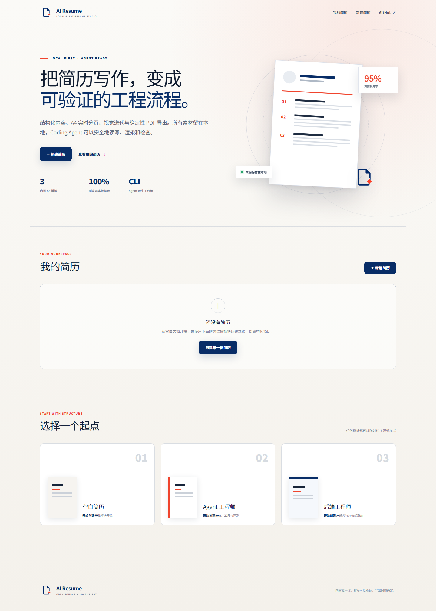

<p align="center">
  
</p>

<h1 align="center">AI Resume</h1>

<p align="center">
  面向 Coding Agent 的本地优先结构化简历工作台。<br />
  把内容、A4 排版、视觉检查和 PDF 导出变成一套可验证的工程流程。
</p>

<p align="center">
  <a href="#快速开始">快速开始</a> ·
  <a href="#cli-与-agent-工作流">CLI 与 Agent</a> ·
  <a href="#开发">参与开发</a>
</p>

> [!NOTE]
> 项目处于早期公开版本（`0.1.x`）。文件格式和核心工作流已经可用，欢迎通过 Issue 和 PR 参与迭代。



## 为什么是 AI Resume

大多数简历工具把内容锁在在线编辑器里，把“适配一页”简化成自动缩小字号。AI Resume 采用不同的边界：

- **内容是结构化数据。** 素材库使用 Markdown，成稿使用可验证的 JSON。
- **数据默认留在本地。** 首页简历库保存在浏览器本地存储，CLI 直接处理工作区文件。
- **Agent 负责判断。** CLI 提供校验、渲染、利用率诊断和导出原子能力，不提供黑盒 `fit 1`。
- **视觉结果必须检查。** Agent 查看真实 A4 PNG，判断密度、裁切、层级和留白后再迭代。
- **PDF 导出可重复。** 使用 Playwright 与打印样式生成确定性 A4 PDF。

## 核心能力

| 能力 | 说明 |
| --- | --- |
| 简历工作台首页 | 查看本地简历、继续编辑、删除草稿，并从空白或岗位模板新建 |
| 结构化编辑 | 基本信息、教育、技能、工作、实习、项目、荣誉、自我评价及自定义模块 |
| A4 实时分页 | 基于真实 DOM 尺寸分页，提示单模块溢出，支持多页预览 |
| 页面利用率诊断 | `render` / `export` 报告每页正文利用率；低于 90% 警告，95%–100% 为建议目标 |
| 三套视觉模板 | 现代编号、经典酒红、校园深蓝；每套模板独立保存排版参数 |
| 本地照片处理 | 浏览器内上传、缩放与定位，不经过远程图片服务 |
| 可撤回编辑 | 内容修改、模板切换和案例载入均可撤回 / 反撤回 |
| Agent Skill | Codex、Claude Code、DeepSeek Harness 共用同一份开放格式 `SKILL.md` |
| PNG / PDF 输出 | CLI 自动启动本地编辑器，生成干净 A4 预览和 PDF |

## 快速开始

### 环境要求

- Node.js `22.13` 或更高版本
- npm `10` 或更高版本

### 安装与启动

```bash
git clone https://github.com/LosAveRoad/ai-resume.git
cd ai-resume
npm install
npm run dev
```

打开 [http://localhost:3000](http://localhost:3000)。首页可以管理多份本地简历，并从以下起点创建：

- 空白简历
- Agent 工程师示例
- 后端工程师示例

所有首页草稿保存在当前浏览器的 `localStorage` 中。清除浏览器站点数据会删除这些草稿；需要版本控制或跨环境使用时，请采用下面的 CLI 文件工作流。

## CLI 与 Agent 工作流

开发仓库内可直接运行：

```bash
npm run cli -- --help
```

也可以链接为全局命令：

```bash
npm link --workspace @ai-resume/cli
ai-resume --help
```

### 1. 初始化文件工作区

```bash
ai-resume init .
```

```text
resume/
├── materials.md   # 真实、可核验的原始素材
├── resume.json    # 当前结构化简历
└── output/        # PNG / PDF 输出
```

### 2. 校验、检查和渲染

```bash
ai-resume validate resume/resume.json
ai-resume inspect resume/resume.json
ai-resume render resume/resume.json --out resume/output/preview.png
```

`render` 会输出页数和每页利用率：

```text
Preview written to .../preview.png
Rendered page count: 1
Page utilization: 95%
```

利用率是正文实际占用高度与页面可用高度的比值：

- `< 90%`：CLI 提示内容可能欠填；优先补充有证据的项目背景、Owner 决策、实现和结果。
- `90%–94%`：继续检查剩余留白和版面节奏。
- `95%–100%`：建议目标区间；仍需检查贴底、拥挤和可读性。

该指标只提供诊断，不会自动改写内容或缩放版面。

### 3. 导出 PDF

```bash
ai-resume export resume/resume.json --out resume/output/resume.pdf
```

导出前应打开 PNG 进行视觉检查；导出后再次检查 PDF 字体、链接、换行和页面边界。

### CLI 命令

```text
ai-resume init [directory]
ai-resume validate [resume.json]
ai-resume inspect [resume.json]
ai-resume dev [--port 3000]
ai-resume render [resume.json] [--out preview.png]
ai-resume export [resume.json] [--out resume.pdf]
ai-resume install-skill --agent <agent> --scope <scope>
ai-resume skill-path
```

## 安装 Agent Skill

安装到当前项目，不覆盖已有文件：

```bash
ai-resume install-skill --agent all --scope project
```

也可以只安装一个适配：

```bash
ai-resume install-skill --agent codex --scope project
ai-resume install-skill --agent claude-code --scope project
ai-resume install-skill --agent deepseek-harness --scope project
```

| Agent | 项目发现目录 | 显式调用 |
| --- | --- | --- |
| Codex | `.agents/skills/ai-resume` | `$ai-resume` |
| Claude Code | `.claude/skills/ai-resume` | `/ai-resume` |
| DeepSeek Harness | `.dsh/skills/ai-resume` | `/ai-resume` |

Skill 会约束 Agent：以素材库为事实边界、为不同岗位创建独立 JSON、反复渲染并检查、优先修改内容而不是压缩字号。

## 数据与模板

`resume.json` 使用版本化 schema。核心结构：

```json
{
  "version": 3,
  "header": {},
  "presentation": {
    "activeTemplate": "numbered-rail",
    "layouts": {}
  },
  "sections": []
}
```

完整字段与约束见 [`schema.md`](packages/cli/skill/ai-resume/references/schema.md)。

内置模板：

| ID | 风格 | 适合场景 |
| --- | --- | --- |
| `numbered-rail` | 现代编号与珊瑚红强调 | 技术岗位、项目型简历 |
| `classic-burgundy` | 经典酒红与紧凑信息层级 | 通用社招、正式岗位 |
| `campus-navy` | 校园深蓝与清晰分区 | 校招、实习、应届生 |

模板共享同一份语义 DOM。新增模板通常只需要作用域 CSS 和注册项，不需要复制编辑器或分页引擎。

## 架构

```text
ai-resume/
├── apps/web/                         # 首页、结构化编辑器、A4 分页与打印样式
├── packages/cli/                     # init / validate / inspect / render / export
│   └── skill/ai-resume/              # 跨 Agent 共用的标准 Skill
├── examples/                         # 素材库与生成示例
├── design/                           # 视觉基准与设计资料
└── docs/images/                      # README 产品截图
```

Web 端使用 React 19 与 vinext；CLI 使用 Node.js 与 Playwright。浏览器首页和 CLI 文件工作流相互独立：前者适合日常可视化编辑，后者适合 Agent、Git 和自动化流程。

## 开发

```bash
# 启动 Web 开发服务器
npm run dev

# 构建 Web 应用
npm run build

# 完整单元与服务端渲染测试
npm test

# 真实浏览器 CLI 端到端测试
npm run test:cli:e2e

# Web lint
npm run lint
```

提交 PR 前至少运行：

```bash
npm run lint
npm test
npm run test:cli:e2e
```

## 隐私与事实边界

- AI Resume 默认不会上传简历、照片或素材。
- 浏览器首页数据保存在当前站点的本地存储中。
- CLI 只读写用户指定的本地文件和输出目录。
- 示例数据用于演示产品能力，不代表示例人物拥有对应上游开源项目。
- Agent 不应虚构教育、经历、指标、项目归属或开源贡献；事实不足时应向用户确认。

## 参与贡献

欢迎提交 Issue 或 PR，尤其是：

- 新的 A4 模板与打印兼容性改进
- 分页、利用率和视觉诊断
- 本地简历库的数据导入 / 导出
- 可访问性与移动端体验
- Agent Skill、CLI 和跨平台兼容性

请保持变更聚焦，并在 PR 中说明测试命令和视觉验证方式。
